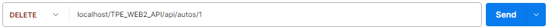

# https://markdown.es/sintaxis-markdown/
## Índice
1. [AutoApiController](#documentación-autopicontroller)
    - [Función `getAll()`](#función-getall)
    - [Función `getAuto()`](#función-getauto)
    - [Función `addAuto()`](#función-addauto)
    - [Función `borrarAuto()`](#función-borrarauto)
    - [Función `editarVehiculo()`](#función-editarvehiculo)

2. [MarcaApiController](#documentacion-marcaapicontroller)
    - [Funcion `getAll()`](#funcion-getall)
    - [Funcion `getMarca()`](#funcion-getmarca)
    - [Funcion `addMarca()`](#funcion-addmarca)
    - [Funcion `borrarMarca()`](#funcion-borrarmarca)
    - [Funcion `editarMarca()`](#funcion-editarmarca)


3. [UserApiController](#documentación-userapicontroller)
    - [Función `getAll()`](#función-getall)
    - [Funcion `getUsuario()`](#funcion-getusuario)
    - [Función `newUser()`](#función-newuser)
    - [Función `deleteUser()`](#función-deletuser)
___

# Documentación `AutoApiController`
## Introducción
Esta API permite gestionar una colección de vehículos. Se puede obtener información sobre todos los vehículos, obtener un vehículo específico por su ID, agregar nuevos vehículos, borrar vehículos existentes, marcar un vehículo como vendido, obtener todos los vehículos de una marca específica y editar la información de un vehículo.

## Endpoints

## Función `getAll()`

### Descripción
Obtiene una lista de todos los vehículos existentes en la base de datos.

### Obtener todos los vehículos
- URL: TPE_WEB2_API/api/autos
- Método: GET

A continuacíon se detalla imágen de la URL:


#### Parámetros query
Los parametros son:
- atribute
- order

#### El valor que puede tomar el order es el siguiente:
- direccion (opcional): Orden de los resultados. Puede ser ASC (ascendente, valor predeterminado) o DESC (descendente).
- asc
- desc
#### Los valores de atribute son los siguientes:
- id_auto (opcional): Filtrar por ID del vehículo.
- marca (opcional): Filtrar por marca del vehículo.
- precio (opcional): Filtrar por precio del vehículo.
- anio (opcional): Filtrar por año del vehículo.
- modelo (opcional): Filtrar por modelo del vehículo.
- color (opcional): Filtrar por color del vehículo.

A continuacíon se detalla imágen de la URL con uno de los "atribute" y "order":


#### Respuestas:
- 200 OK: Lista de vehículos.
- 404 Not Found: No hay vehículos en la base de datos.

## Función `getAuto()`

### Descripción
La función `getAuto` del controlador obtiene un vehiculo específico de la base de datos, para ello, se necesita especificarle el ID.

#### Parámetros de la función:
- ID (obligatorio): ID del vehículo.

### Obtener un vehículo por ID
- URL: TPE_WEB2_API/api/autos/1
- Método: GET

A continuacíon se detalla imágen de la URL:


#### Respuestas:
- 200 OK: Información del vehículo.
- 404 Not Found: No existe el vehículo en la base de datos.

## Función `addAuto()`

### Descripción
La función `addAuto` del controlador crea un nuevo vehiculo pasandole toda la descripcion del mismo en formato JSON.
IMPORTANTE: NO SE PUEDE AGREGAR UN VEHICULO SIN ANTES AGREGAR AL MENOS UNA MARCA EN LA BASE DE DATOS.

### Agregar un vehículo
- URL: TPE_WEB2_API/api/autos
- Método: POST
- Cuerpo que se necesita para enviar la solicitud:


A continuacíon se detalla imágen de la URL:


#### Respuestas:
- 201 Created: Se insertó el vehiculo correctamente.
- 404 Not Found: Error al insertar el vehiculo.
- 404 Not Found: No se puede agregar un vehiculo sin una marca existente.

## Función `borrarAuto()`

### Descripción
Como resultado de esta funcion, se elimina un vehiculo en especifico. Para ello, se necesita especificar en la URL el ID.

### Eliminar un vehículo
- URL: TPE_WEB2_API/api/autos/1
- Método: DELETE

#### Parámetros:
- ID (obligatorio): ID del vehículo.

A continuacíon se detalla imágen de la URL:



#### Respuestas:
- 200 OK: Vehículo eliminado exitosamente.
- 404 Not Found: Vehículo no encontrado.

## Función `editarVehiculo()`

### Descripción
Como resultado de esta función, se edita la totalidad de los atributos del vehiculo y se actualiza en la base de datos. Se necesita especificar el ID en la URL.

### Editar un vehículo
- URL: TPE_WEB2_API/api/autos/1
- Método: PUT
- Cuerpo que se necesita para enviar la solicitud:


- A continuacíon se detalla imágen de la URL:


#### Parámetros:
- ID (obligatorio): ID del vehículo.
```json
{
  "modelo": "string", //Cadena
  "anio": "integer", //Entero
  "precio": "float", //Decimal
  "color": "string", //Cadena
  "vendido": "boolean" //Verdadero o falso (0 es no vendido y 1 es vendido)
}
```

#### Respuestas:
- 201 Created: Vehículo actualizado correctamente.
- 404 Not Found: No existe la marca con id (id de X marca) en la base de datos.
- 404 Not Found: No existe el vehiculo en la base de datos.
- 500 Internal Server Error: Error de conexión.

# Uso con Postman
Para probar esta API con Postman, necesitas tener instalado el XAMPP y tener tu proyecto guardado en la carpeta HTDOCS:

- Obtener todos los vehículos: Crear una nueva solicitud GET a TPE_WEB2_API/api/autos.

- Obtener un vehículo por ID: Crear una nueva solicitud GET a TPE_WEB2_API/api/autos?id_auto=1, reemplazando 1 con el ID del vehículo que quieras obtener de la base de datos.

- Agregar un vehículo: Crear una nueva solicitud POST a TPE_WEB2_API/api/autos y agregar el JSON del cuerpo de la solicitud como se mostró anteriormente.

- Eliminar un vehículo: Crear una nueva solicitud DELETE a TPE_WEB2_API/api/autos/1, reemplazando 1 con el ID del vehículo que se desea eliminar.

- Marcar un vehículo como vendido: Crear una nueva solicitud PUT a TPE_WEB2_API/api/autos/1, reemplazando 1 con el ID del vehículo.

- Editar un vehículo: Crear una nueva solicitud PUT a TPE_WEB2_API/api/autos/1, reemplazando 1 con el ID del vehículo y agregar el JSON del cuerpo de la solicitud para enviar la edición del vehiculo a la base de datos.


# Documentación `MarcaApiController`
## Introducción
Esta API permite gestionar una colección de marcas. Se puede obtener información sobre todas las marcas, obtener una marca específica por su ID, por su pais de origen o año de fundación, agregar nuevas marcas y borrar marcas existentes.

## Función `getAll()`

### Descripción
Obtiene una lista de todos los vehículos existentes en la base de datos.

## Endpoints

### Obtener todas las marcas
- URL: TPE_WEB2_API/api/marcas
- Método: GET

A continuacíon se detalla imágen de la URL:


#### Parámetros query
Los parametros son:
- atribute
- order

#### El valor que puede tomar el order es el siguiente:
- direccion (opcional): Orden de los resultados. Puede ser ASC (ascendente, valor predeterminado) o DESC (descendente).
- asc
- desc

#### Los valores de atribute son los siguientes:
- id_marca (opcional): Filtrar por ID de la marca.
- nombre (opcional): Filtrar por nombre de la marca.
- pais_de_origen (opcional): Filtrar por país de origen de la marca.
- ano_de_fundacion (opcional): Filtrar por año de fundación de la marca..

A continuacíon se detalla imágen de la URL con uno de los "atribute" y "order":


#### Respuestas:
- 200 OK: Lista de marcas.
- 404 Not Found: No hay marcas en la base de datos.

## Función `getMarca()`

### Descripción
La función `getMarca` del controlador obtiene una marca específica de la base de datos, para ello, se necesita especificarle el ID.

### Obtener una marca por ID
- URL: localhost/TPE_WEB2_API/api/marca/1
- Método: GET

A continuacíon se detalla imágen de la URL:


#### Parámetros:
- ID (obligatorio): ID de la marca.

#### Respuestas:
- 200 OK: Información de la marca.
- 404 Not Found: No existe la marca en la base de datos.
- 500 Internal Server Error: Error del servidor.

## Función `addMarca()`

### Descripción
La función `addMarca` del controlador crea una nueva marca pasandole toda la descripcion de la misma en formato JSON.

### Agregar una marca
- URL: TPE_WEB2_API/api/marca
- Método: POST
- Cuerpo que se necesita para enviar la solicitud:


A continuacíon se detalla imágen de la URL:


```json
{
  "nombre": "string", //Cadena
  "pais_de_origen": "string", //Cadena
  "ano_de_fundacion": "integer", //Entero
  "descripcion": "string" //Cadena
}
```
#### Respuestas:
- 200 OK: Marca agregada exitosamente.
- 500 Internal Server Error: Error al insertar la marca.

## Función `borrarMarca()`

### Descripción
Como resultado de esta funcion, se elimina una marca en especifico. Para ello, se necesita especificar en la URL el ID.

### Eliminar una marca
- URL: TPE_WEB2_API/api/marca/1
- Método: DELETE

#### Parámetros:
- ID (obligatorio): ID de la marca.

A continuacíon se detalla imágen de la URL:


#### Respuestas:
- 200 OK: Marca eliminada exitosamente.
- 404 Not Found: Marca no encontrada.

## Función `editarMarca()`

### Descripción
Como resultado de esta función, se edita la totalidad de los atributos de la marca y se actualiza en la base de datos. Se necesita especificar el ID en la URL.

### Editar una marca
- URL: /marcas/:ID
- Método: PUT

#### Parámetros:
- ID (obligatorio): ID de la marca.
- Cuerpo que se necesita para enviar la solicitud:


A continuacíon se detalla imágen de la URL:


```json
{
  "nombre": "string",
  "pais_de_origen": "string",
  "ano_de_fundacion": "integer",
  "descripcion": "string"
}
```
#### Respuestas:
- 200 OK: Marca actualizada exitosamente.
- 404 Not Found: Marca no encontrada.
- 500 Internal Server Error: Error al actualizar la marca.

# Uso con Postman
Para probar esta API con Postman, necesitas tener instalado el XAMPP y tener tu proyecto guardado en la carpeta HTDOCS:

- Obtener todas las marcas: Crear una nueva solicitud GET a TPE_WEB2_API/api/marcas.

- Obtener una marca por ID: Crear una nueva solicitud GET a TPE_WEB2_API/api/marca/1, reemplazando 1 con el ID de la marca.

- Agregar una marca: Crear una nueva solicitud POST a TPE_WEB2_API/api/marca y agregar el JSON del cuerpo de la solicitud.

- Eliminar una marca: Crear una nueva solicitud DELETE a TPE_WEB2_API/api/marca/1, reemplazando 1 con el ID de la marca.

- Editar una marca: Crear una nueva solicitud PUT a TPE_WEB2_API/api/editMarca/1, reemplazando 1 con el ID de la marca y agregar el JSON del cuerpo de la solicitud.


# Documentación `UserApiController`
## Introducción
La clase UserApiController permite la gestión de usuarios a través de una API. Facilita la obtención de todos los usuarios, la obtención de un usuario específico por su ID, por email o rol (user o admin), la adición de nuevos usuarios y la eliminación de usuarios existentes. La clase utiliza un modelo para interactuar con la base de datos y una vista para devolver respuestas en formato JSON.

## Función `getAll()`
### Descripción
En esta función,  obtienen todos los usuarios existentes en la base de datos.

## Endpoints

### Obtener todos los usuarios
- URL: /usuarios
- Método: GET

A continuacíon se detalla imágen de la URL:


#### Parámetros query
Los parametros son:
- atribute
- order

#### El valor que puede tomar el order es el siguiente:
- direccion (opcional): Orden de los resultados. Puede ser ASC (ascendente, valor predeterminado) o DESC (descendente).
- asc
- desc

#### Los valores de atribute son los siguientes:
- id (opcional): Filtrar por ID del usuario.
- email (opcional): Filtrar por correo electrónico del usuario.
- rol (opcional): Filtrar por rol del usuario.

A continuacíon se detalla imágen de la URL con uno de los "atribute" y "order":


#### Respuestas:
- 200 OK: Lista de usuarios.
- 404 Not Found: No hay usuarios en la base de datos.

## Función `getUsuario()`

### Descripción
Esta función está dedicada a la obtención de todos un usuario en especifico en la base de datos, para ello se requiere el ID en la URL.

### Obtener un usuario por ID
- URL: /usuarios/:ID
- Método: GET

A continuacíon se detalla imágen de la URL:


#### Parámetros:
- ID (obligatorio): ID del usuario.

#### Respuestas:
- 200 OK: Información del usuario.
- 404 Not Found: No existe el usuario en la base de datos.
- 500 Internal Server Error: Error del servidor.


## Función `newUser()`

### Descripción
La finalidad de esta función es crear un usuario en la base de datos. Se requiere enviar toda la info en formato JSON.

### Agregar un nuevo usuario
- URL: /usuarios
- Método: POST
- Cuerpo que se necesita para enviar la solicitud:


A continuacíon se detalla imágen de la URL:


```json
{
  "email": "string", //Cadena
  "password": "string", //Cadena
  "rol": "string" //Cadena
}
```
#### Respuestas:
- 201 Created: Usuario agregado exitosamente.
- 500 Internal Server Error: Error al insertar el usuario.

## Función `deleteUser()`

### Descripción
Con esta función, vas a poder borrar un usuario existente en la base de datos. Se requiere especificar el ID en la URL.

### Eliminar un usuario
- URL: /usuarios/:ID
- Método: DELETE

#### Parámetros:
- ID (obligatorio): ID del usuario.

A continuacíon se detalla imágen de la URL:


#### Respuestas:
- 200 OK: Usuario eliminado exitosamente.
- 404 Not Found: Usuario no encontrado.

# Uso con Postman
Para probar esta API con Postman, necesitas tener instalado el XAMPP y tener tu proyecto guardado en la carpeta HTDOCS:

- Obtener todos los usuarios: Crear una nueva solicitud GET a TPE_WEB2_API/api/usuarios/.

- Obtener un usuario por ID: Crear una nueva solicitud GET a TPE_WEB2_API/api/usuarios/1, reemplazando 1 con el ID del usuario.

- Agregar un nuevo usuario: Crear una nueva solicitud POST a TPE_WEB2_API/api/usuarios/ y agregar el JSON del cuerpo de la solicitud.

- Eliminar un usuario: Crear una nueva solicitud DELETE a TPE_WEB2_API/api/usuarios/1, reemplazando 1 con el ID del usuario.


